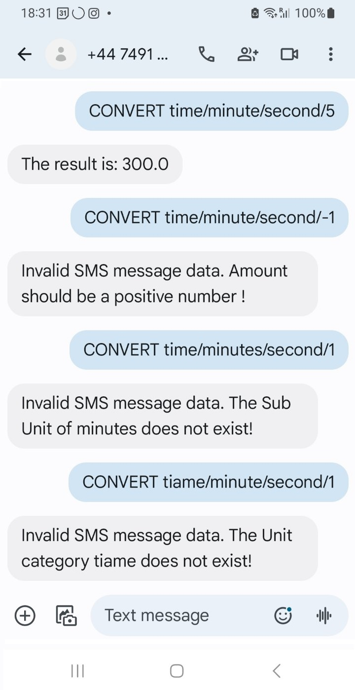

<div align="center">
  <h1>Unit Conversion Using SMS (text messages)</h1>
</div>

<div align="center">

[](LICENSE)

</div>

<details open="open">
<summary>Table of Contents</summary>

- [About](#about)
  - [Built With](#built-with)
- [Getting Started](#getting-started)
  - [Prerequisites](#prerequisites)
  - [Usage](#usage)
    - [Manual setup](#manual-setup)
    - [Environment variables](#environment-variables)
- [Screenshots](#screenshots)
- [License](#license)

</details>

---

## About

<table>
<tr>
<td>

This project makes unit conversion super easy through SMS (text messages). By using modern web technologies and SMS services, you can convert units just by sending a text. The system takes your SMS, does the conversion, and texts you back the result. It's designed to be a handy and accessible tool for converting units without needing internet access or special apps. Perfect for use in remote areas or when you're on the move.

You can also use the website for the unit conversion. The purpose of this project was to demonstrate how can you over-engineer solutions, imagine converting kilograms to grams using a text message!

Project uses Infobip API for SMS sending. I was using this [documentation](https://www.infobip.com/docs/api#programmable-communications/sms/get-received-sms).

The way it works is that I'm pulling any incoming SMS messages from the Infobip's API by using a Python scheduler to scan an URL.
If we found any new messages, let parse that message and inform the User!

</td>
</tr>
</table>

### Built With

The project uses these technologies:
- **Flask**: A lightweight WSGI web application framework in Python, used to build the web interface for unit conversion.
- **jQuery**: A fast, small, and feature-rich JavaScript library, used for DOM manipulation and handling AJAX requests.
- **Bootstrap**: A popular front-end framework for developing responsive and mobile-first websites.
- **Infobip API**: A communication platform as a service (CPaaS) that provides SMS messaging capabilities.
- **Python**: The primary programming language used for backend development.
- **HTML/CSS**: Standard technologies for creating and styling the web interface.
- **JavaScript**: Used for client-side scripting to enhance user interaction on the web interface.
- **Logging**: Python's built-in logging module is used to track the application's activities and debug issues.

## Getting Started

### Prerequisites

It is recommended to use VS Code or Cursor for this project.
Python version that was used to develop the project: **3.9.13**

### Usage

#### Manual setup

Please follow these steps for manual setup:
0. Set-up the Discord bot on the Discord Developer Portal and add it to your server.
1. Download this GitHub repository.
2. Create a virtual environment.

```
python3 -m venv <myenvname>
```

3. Activate virtual environment.

```
cd venv
Scripts\Activate.ps1
```
Or different Activate script, if you are not working from Visual Code.

4. Install packages from requirements.txt

```
pip install -r /path/to/requirements.txt
```

5. Replace environment variables with your PostgreSQL/Discord API credentials in the .env file.<br>
   **Replace ```SMS_SERVICE_INFOBIP_API_KEY``` to your INFOBIP API KEY**.
   **Also change  ```SMS_SERVICE_FROM_NUMBER``` to the phone number you received from Infobip.**

6. Run the app.


#### Environment variables

in the .env file, replace these environment variables with your PostgreSQL database credentials.

| Name                       |  Description                                                                 |
| -------------------------- | ---------------------------------------------------------------------------  |
| SMS_SERVICE_INFOBIP_API_KEY      | Infobip API KEY                                                         |
| SMS_SERVICE_FROM_NUMBER   | Infobip Phone number                         |


## Screenshots

<br>
*This screenshot shows the main interface of the unit conversion web application.*

<br>
*This screenshot demonstrates the result.*

<br>
*This screenshot demonstrates how SMS conversion work.*

## License

This project is licensed under the **MIT license**. Feel free to edit and distribute this template as you like.

See [LICENSE](LICENSE) for more information.
